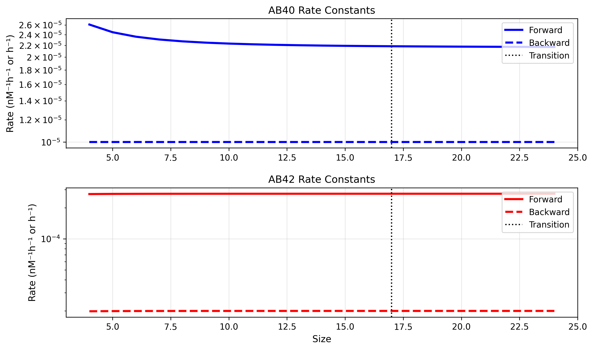

# Model Details

This document provides detailed technical information about the Geerts model implementation, including module structure, methodology, and key technical considerations.

## Table of Contents
- [Model Architecture](#model-architecture)
- [Module Structure](#module-structure)
- [ODE to Reactions Translation](#ode-to-reactions-translation)
- [Key Technical Components](#key-technical-components)
- [Parameter Management](#parameter-management)
- [Model Generation and Execution](#model-generation-and-execution)

## Model Architecture

The model is implemented using a modular architecture where individual biological processes are separated into distinct modules. This approach provides several advantages:

- **Modularity**: Each biological process can be developed and validated independently
- **Flexibility**: Components can be easily modified or replaced
- **Maintainability**: Clear separation of concerns makes debugging easier
- **Reusability**: Modules can be reused in different model configurations

### Multiple Implementation Approaches

1. **SBML-based Implementation**: Uses Systems Biology Markup Language for model representation
2. **Direct ODE Implementation**: JAX-based ODE system directly translated from published equations


## Model Structure

The model is organized into several modules, each responsible for specific aspects of the system:

### QSP Components (Amyloid Beta Kinetics)

1. **[AB_production.py](Modules/AB_production.py)**
   - Models amyloid precursor protein (APP) processing and Aβ production
   - Includes APP production, C99 fragment formation, Aβ40 and Aβ42 monomer production
   - Accounts for IDE-mediated clearance of Aβ monomers

2. **[Geerts_dimer.py](Modules/Geerts_dimer.py)**
   - Models Aβ dimer formation and dynamics
   - Includes dimer formation from monomers, dissociation back to monomers
   - Accounts for plaque-catalyzed dimer formation and antibody binding

3. **[Geerts_Oligomer_3_12.py](Modules/Geerts_Oligomer_3_12.py)**
   - Models small Aβ oligomer formation and dynamics (3-12mers)
   - Includes oligomer formation from smaller species and monomers
   - Accounts for oligomer dissociation, plaque formation, and antibody binding
   - Includes antibody binding and microglia-mediated clearance

4. **[Geerts_Oligomer_13_16.py](Modules/Geerts_Oligomer_13_16.py)**
   - Models medium Aβ oligomer formation and dynamics (13-16mers)
   - Similar processes to small oligomers but for larger species
   - Includes transition to plaque formation
   - Includes antibody binding and microglia-mediated clearance


5. **[Geerts_Fibril_17_18.py](Modules/Geerts_Fibril_17_18.py)**
   - Models small Aβ fibril formation and dynamics (17-18mers)
   - Includes fibril formation from oligomers and monomers
   - Accounts for fibril dissociation and plaque formation
   - Includes antibody binding and microglia-mediated clearance

6. **[Geerts_Fibril_19_24.py](Modules/Geerts_Fibril_19_24.py)**
   - Models large Aβ fibril (19-24mers) and plaque formation and dynamics 
   - Similar processes to small fibrils but for larger species
   - Includes final transition to plaque formation
   - Includes antibody binding and microglia-mediated clearance


### PBPK Components (Antibody Distribution)

1. **[Geerts_PBPK_mAb.py](Modules/Geerts_PBPK_mAb.py)**
   - Models monoclonal antibody (mAb) pharmacokinetics in the brain
   - Includes antibody distribution across blood-brain barrier (BBB)
   - Accounts for FcRn-mediated antibody recycling
   - Includes antibody binding to Aβ species and clearance mechanisms

2. **[Geerts_PBPK_monomers.py](Modules/Geerts_PBPK_monomers.py)**
   - Models Aβ monomer pharmacokinetics in the brain
   - Could be considered part of the QSP model, but this is very Physiology Based 
   - Includes monomer distribution across BBB and blood-CSF barrier
   - Accounts for monomer clearance through various pathways
   - Includes monomer production and degradation
   - Includes monomer antibody binding reactions 

3. **[Geerts_PVS_ARIA.py](Modules/Geerts_PVS_ARIA.py)**
   - Models perivascular space (PVS) dynamics
   - ARIA is not implemented yet
   - Includes perivascular space fluid flow and transport
   - Includes clearance of Aβ through the glymphatic system
   - Models antibody and Aβ transport between PVS and ISF

4. **[geerts_microglia.py](Modules/geerts_microglia.py)**
   - Models microglia-mediated clearance of Aβ species
   - Includes microglia dependent clearance of bound species 
   - Accounts for high and low activity states
   - Includes antibody-dependent microglial activation
   - Models microglia cell population dynamics


## ODE to Reactions Translation

A key aspect of this implementation is the translation from published ordinary differential equations (ODEs) to reaction-based SBML format. This translation required several important considerations:

### Mass Units Conversion
The original Geerts model uses concentration units (nM), but SBML reactions work best with mass units. Our implementation:
- Converts all concentrations to mass units using compartment volumes
- Maintains consistency across all reactions and rate constants
- Validates the conversion by comparing with direct ODE implementation

### Reaction Network Construction
Each ODE term is translated into corresponding reactions:
- Production terms become synthesis reactions
- Degradation terms become degradation reactions  
- Transport terms become transport reactions between compartments
- Binding interactions become association/dissociation reaction pairs
- Some Rate Rules / Assignment Rules are still required for time dependent terms 
    - Microglia Cell Count
    - IDE clearance rate 
    - Antibody Dosing forcing function 

### Rate Constant Handling
Rate constants are carefully managed to ensure:
- Proper units (converted from concentration-based to mass-based rates)
- Appropriate scaling for compartment volumes

## Key Technical Components

### Rate Constant Extrapolation

The model uses sophisticated rate extrapolation implemented in `K_rates_extrapolate.py`:


*Forward and Backward rate constants for higher order aggregates extrapolated from experimentally determined low order rates. This section of the model has minimal information in the supplement and is likely to be one of the primary areas for improvement. We suspect issues with the backward rate constants being much lower than the referenced material.*


**Key Features:**
- Uses experimentally determined rates for small oligomers as anchor points
- Handles Aβ40 and Aβ42 separately with different aggregation propensities
- **Note**: Backward rates are not provided in the original supplement and are copied from referenced paper [Garai 2013](https://www.pnas.org/doi/10.1073/pnas.1222478110?url_ver=Z39.88-2003&rfr_id=ori%3Arid%3Acrossref.org&rfr_dat=cr_pub++0pubmed)
- **Note**: Found issues with Garai Rates including one issue in publication itself and another discrepancy between rate in Geerts and published rate
    - Garai et al. 2013 Figure 7 fails for published value of dimer to trimer rate for Abeta 42: k+23 (kf1 in Geerts) = 38 (M⁻¹s⁻¹), but is reproducible with k+23 = 380 (M⁻¹s⁻¹)
    - Geerts TableS2 cites Garai for kf0 and kf1, but is missing kb0 and kb1
    - Geerts TableS2 has kf0 ABeta 42 = 0.0003564 nM/h = 9.9 (M⁻¹s⁻¹) when Garai has 9.9 (M⁻¹s⁻¹) × 10²

The full rate extrapolation can be seen here with the x-axis being oligomer size. Notice how for Abeta 42 the backward rate is always above the forward rate. We believe this is responsible for the overabundance in monomers and failure to aggregate. 




### IDE Clearance Decline with Age

The model implements age-dependent decline in insulin-degrading enzyme (IDE) clearance in the equation for monomer dynamics:


The clearance term has its own time-dependent behavior 


**Important Note**: This age-dependent decline is mentioned in the main publication but the specific equation and parameters are not provided in Supplementary Table 2. 

```
# This term is represented here as it is in TableS2 without the slope or time dependent behavior

 -(IDE_conc * AB42_IDE_Kcat_lin * ((AB42_Monomer * Unit_removal_1)^AB42_IDE_Hill / ((AB42_Monomer * Unit_removal_1)^AB42_IDE_Hill 

```

No equation is given to show how clearance changes with age so we chose to implement one based on the IDE equation from the main paper. A linear slope was unavailable in the supplement so we chose to use the published exponential decline rate. 

### Individual Oligomer Tracking

The model tracks individual oligomer species (2-mers through 24-mers) rather than using averaged pools. This provides:

- **Detailed Species Resolution**: Each oligomer size has distinct kinetic properties
- **Size-Dependent Behavior**: Aggregation and clearance rates vary with oligomer size  
- **Validation Capability**: Individual species can be compared with experimental data
- **Mechanistic Insight**: Understanding of aggregation cascade progression


### Microglia Dynamics with Dosing

Microglia activation responds to antibody-bound amyloid:


*Results for Gantenerumab 3-year study with dosing every 4 weeks for 1.5 years*

**Dynamic Features:**
- Baseline activation level in absence of treatment
- Enhanced activation in response to antibody-bound Aβ
- Cell population dynamics
- Clearance capacity modulation

## Parameter Management

### Parameter Documentation Structure

Parameters are stored in `parameters/PK_Geerts.csv` with comprehensive documentation:

| Column | Description |
|--------|-------------|
| name | Parameter identifier used in code |
| value | Numerical value |
| units | Physical units |
| Sup_Name | Original name from Geerts supplement |
| Source | Literature reference |
| Validated | Binary flag (1 = personally verified) |
| Notes | Additional comments |

### Parameter Validation Status

The model includes a systematic parameter validation approach:
- **Validated Parameters** (Validated = 1): Personally verified against literature
- **Unvalidated Parameters** (Validated = 0): Require further verification
- **Source Traceability**: Each parameter linked to specific literature reference
- **Units Standardization**: All parameters use consistent unit systems

## Model Generation and Execution

### Generation Process

1. **Module Combination**: `Combined_Master_Model.py` merges all modules
2. **SBML Export**: Generated model saved as XML in `generated/sbml/`
3. **JAX Conversion**: SBML converted to JAX format using `sbml_to_ode_jax`
4. **Validation**: Cross-validation with direct ODE implementation

### Execution Schemes

#### Multi-Dose Simulation
```
1. Generate combined SBML model
2. Convert to JAX format  
3. Run steady-state simulation (no dose)
4. Use steady-state as initial condition
5. Apply dosing schedule
6. Generate comprehensive outputs
```

#### No-Dose Simulation
```
1. Generate model without dosing components
2. Run long-term simulation (20-100 years)
3. Focus on natural Aβ aggregation dynamics
4. Useful for parameter sensitivity analysis
```

### Solver Configuration

The model uses sophisticated ODE solvers:
- **Primary Solver**: Tsit5 (5th order Runge-Kutta)
- **JAX Integration**: Leverages JAX for automatic differentiation 
- **Diffrax Backend**: Modern ODE solving with advanced numerical methods

## Technical Limitations and Considerations

### Current Limitations

1. **Aggregation Dynamics**: Investigating discrepancies in Aβ aggregation behavior
2. **Parameter Uncertainty**: Some parameters lack direct experimental validation
3. **Computational Cost**: Full model has significant runtime for long simulations
4. **Initial Condition**: Given the issues with Abeta aggregation when simulating the natural life cycle we cannot use the 70-year result as an initial condition for drug dosing. At the moment we use 1000 hours. Anything more increases runtime likely due to unrealistic amounts of Abeta. 

### Ongoing Validation

- Parameter sensitivity analysis using Tellurium framework
- Comparison with published experimental data
- Investigation of aggregation pathway parameters 