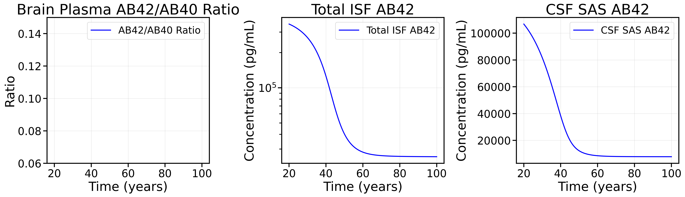
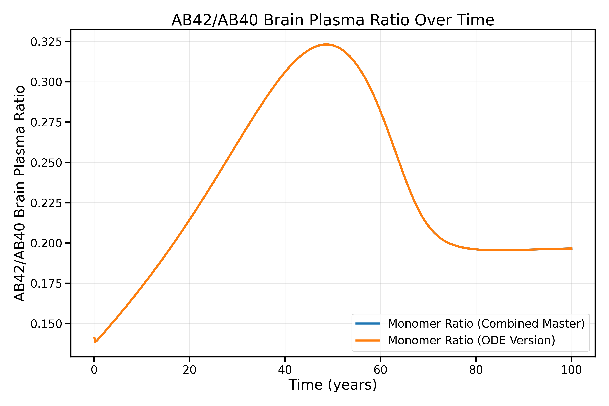

# Geerts Model Documentation

This folder contains a comprehensive model of amyloid beta (Aβ) dynamics and antibody pharmacokinetics in the brain, based on the work of Geerts et al. The model combines both Quantitative Systems Pharmacology (QSP) components for Aβ kinetics and Physiologically Based Pharmacokinetic (PBPK) components for antibody distribution.

## Citation
Geerts H, Walker M, Rose R, et al. A combined physiologically-based pharmacokinetic and quantitative systems pharmacology model for modeling amyloid aggregation in Alzheimer's disease. CPT Pharmacometrics Syst Pharmacol. 2023; 12: 444-461. doi:10.1002/psp4.12912

## Usage

To run the SBML model:
1. Ensure all dependencies are installed
2. Make sure you are in Geerts directory 
   `cd models/Geerts` 
3. Run `python run_combined_master_model_multi_dose.py --drug {gantenerumab,lecanemab}`
   or `python run_no_dose_combined_master_model.py --drug {gantenerumab,lecanemab} --years 10` 
   or `python run_mAb.py --drug {gantenerumab,lecanemab}`
4. Specify drug type (gantenerumab or lecanemab) if needed
5. View generated plots in the `generated/figures` directory

## Runtime and Alternative Versions

The full combined model (`run_combined_master_model_multi_dose.py`) has a long runtime due to its complexity and the number of species being simulated. For faster testing and validation, several alternative versions are available:

1. **Single-Dose Version**
   - [`run_combined_master_model.py`](run_combined_master_model.py) provides a simpler single-dose simulation
   - This version first runs a simulation of the patient's age before treatment (no dose)
   - The final state from this simulation is used as the initial condition
   - Then applies a single dose according to the specified dosing schedule
   - This approach is useful for validating model behavior and comparing with published results
   - [`run_no_dose_combined_master_model.py`](run_no_dose_combined_master_model.py) also exists for no antibody at all 

2. **Multi-Dose Version**
   - [`run_combined_master_model_multi_dose.py`](run_combined_master_model_multi_dose.py) 
3. **No Dose Version**
   - [`python run_no_dose_combined_master_model.py --drug {gantenerumab,lecanemab} --years 10`](run_no_dose_combined_master_model.py)


## ODE-Based Alternative Implementation

An alternative implementation of the Geerts model is available in the `ODE_version` directory. This version was created by directly translating the differential equations from the Geerts et al. 2023 paper's Supplementary Table S1 into Python code.


### Model Generation

The model is generated using `generate_model_2.py`, which:
- Reads equations directly from an Excel file `Geerts_ODE.xlsx`containing the ODEs from Supplementary Table S1
- Matches parameters in equations to values in `Geerts_Params_2.csv`
- Automatically parses and converts the equations into Python/JAX code
- Generates a standalone ODE model in `generated_model_2.py`
- Uses its own parameter file for initialization

### Running the ODE Version

To run the ODE-based version without antibody dosing:

```bash
cd models/Geerts/ODE_version
python run_no_dose.py --years 10 --outdir results/no_dose
```

Command line arguments:
- `--drug`: Choose between 'gantenerumab' or 'lecanemab' (affects parameter values)
- `--years`: Number of years to simulate (default: 10)
- `--outdir`: Directory to save results (default: 'results/no_dose')

The simulation will generate several plots showing:
- AB42/AB40 ratios over time
- Oligomer and monomer loads
- Plaque and fibril dynamics
- SUVR progression
- Microglia activation
- Species composition for both AB40 and AB42

### Key Differences from SBML Version

This ODE-based implementation:
- Directly uses the equations from the paper without SBML intermediary
- Uses JAX for efficient computation
- Currently only implements the no-dose version of the model
- Much faster computation time and similar results to SBML version
- Has its own parameters file so changes to PK_Geerts.csv will not chnage this model 

### Limitations of the ODE Version

The ODE version has some limitations compared to the SBML implementation:

1. **No IDE Clearance Decline with Age**: The decline in IDE-mediated clearance of monomers with age is not implemented in the ODE version because it is not directly written in Supplementary Table 1 of the Geerts et al. paper. This may lead to faster clearance of monomers in older age simulations compared to the SBML model.

2. **Microglia Cell Count Limitations**: In the ODE implementation, the microglia cell count never surpasses 1 (the initial value) because the equation for the sum of antibody-bound amyloid is set to zero (`new_state['Anti_ABeta_bound_sum'] = 0`) as specified in the supplementary table. Since this sum is an important term in the microglia cell count equation, it prevents proper microglia proliferation in response to antibody-bound amyloid.


## Model Structure

The model is organized into several modules, each responsible for specific aspects of the system:

### QSP Components (Amyloid Beta Kinetics)

1. **[AB_production.py](Modules/AB_production.py)**
   - Models amyloid precursor protein (APP) processing and Aβ production
   - Includes APP production, C99 fragment formation, Aβ40 and Aβ42 monomer production
   - Accounts for IDE-mediated clearance of Aβ monomers

2. **[Geerts_dimer.py](Modules/Geerts_dimer.py)**
   - Models Aβ dimer formation and dynamics
   - Includes dimer formation from monomers, dissociation back to monomers
   - Accounts for plaque-catalyzed dimer formation and antibody binding
   - Includes microglia-mediated clearance of dimers

3. **[Geerts_Oligomer_3_12.py](Modules/Geerts_Oligomer_3_12.py)**
   - Models small Aβ oligomer formation and dynamics (3-12mers)
   - Includes oligomer formation from smaller species and monomers
   - Accounts for oligomer dissociation, plaque formation, and antibody binding
   - Includes microglia-mediated clearance and transport coefficients

4. **[Geerts_Oligomer_13_16.py](Modules/Geerts_Oligomer_13_16.py)**
   - Models medium Aβ oligomer formation and dynamics (13-16mers)
   - Similar processes to small oligomers but for larger species
   - Includes transition to plaque formation

5. **[Geerts_Fibril_17_18.py](Modules/Geerts_Fibril_17_18.py)**
   - Models small Aβ fibril formation and dynamics (17-18mers)
   - Includes fibril formation from oligomers and monomers
   - Accounts for fibril dissociation and plaque formation
   - Includes antibody binding and microglia-mediated clearance

6. **[Geerts_Fibril_19_24.py](Modules/Geerts_Fibril_19_24.py)**
   - Models large Aβ fibril (19-24mers) and plaque formation and dynamics 
   - Similar processes to small fibrils but for larger species
   - Includes final transition to plaque formation

### PBPK Components (Antibody Distribution)

1. **[Geerts_PBPK_mAb.py](Modules/Geerts_PBPK_mAb.py)**
   - Models monoclonal antibody (mAb) pharmacokinetics in the brain
   - Includes antibody distribution across blood-brain barrier (BBB)
   - Accounts for FcRn-mediated antibody recycling
   - Includes antibody binding to Aβ species and clearance mechanisms

2. **[Geerts_PBPK_monomers.py](Modules/Geerts_PBPK_monomers.py)**
   - Models Aβ monomer pharmacokinetics in the brain
   - Could be considerd part of the QSP model, but this is very Physiology Based 
   - Includes monomer distribution across BBB and blood-CSF barrier
   - Accounts for monomer clearance through various pathways
   - Includes monomer production and degradation
   - Includes monomer antibody binding reactions 

3. **[Geerts_PVS_ARIA.py](Modules/Geerts_PVS_ARIA.py)**
   - Models perivascular space (PVS) dynamics and ARIA
   - Includes perivascular space fluid flow and transport
   - Includes clearance of Aβ through the glymphatic system
   - Models antibody and Aβ transport between PVS and ISF

4. **[geerts_microglia.py](Modules/geerts_microglia.py)**
   - Models microglia-mediated clearance of Aβ species
   - Includes microglia dependent clearance of bound species 
   - Accounts for high and low activity states
   - Includes antibody-dependent microglial activation
   - Models microglia cell population dynamics

## Model Generation and Simulation

The model is generated and simulated through several steps:

1. **Model Generation**
   - [`Combined_Master_Model.py`](Modules/Combined_Master_Model.py) combines all modules into a single SBML model
   - The generated SBML model is saved in `generated/sbml/combined_master_model_{drug_type}.xml`
   - Each module contributes its specific components to the final model

2. **Model Simulation**
   - [`run_combined_master_model_multi_dose.py`](run_combined_master_model_multi_dose.py) handles model simulation
   - The script:
     - Creates and loads the SBML model
     - Converts it to a JAX model using `sbml_to_ode_jax`
     - Extracts rates and assignment rules
     - Solves the system using `diffrax` instead of the sbml_to_ode_jax built-in `Model_rollout`
     - Generates various plots of the simulation results

3. **Alternative Simulation Methods**
   - The model can also be simulated using:
     - `sbml_to_ode_jax`'s built-in `Model_rollout` function
     - `roadrunner` for direct simulation from the XML file
     - Other SBML-compatible simulators

## Visualization Options

The model provides several tools for visualizing simulation results:

1. **Real-time Visualization**
   - When running simulations, plots are automatically generated in the `generated/figures` directory

2. **Post-simulation Visualization**
   - [`plot_saved_solution.py`](plot_saved_solution.py): Visualizes data from full model runs with dosing
     - Used for analyzing output from `run_combined_master_model_multi_dose.py`
     - Creates comprehensive plots of drug concentrations, Aβ dynamics, and compartmental distributions
     - Usage: `python plot_saved_solution.py --drug {gantenerumab,lecanemab}`

   - [`visualize_steady_state.py`](visualize_steady_state.py): Visualizes steady state or no-dose data
     - Works with data from `run_no_dose_combined_master_model.py` or the intermediate steady-state output from `run_combined_master_model_multi_dose.py`
     - Useful for understanding pre-dose dynamics and baseline Aβ behavior
     - Usage: `python visualize_steady_state.py --drug {gantenerumab,lecanemab}`
     - To change which data file is visualized, modify the path in the `load_steady_state_data()` function:
       ```python
       # Current options include:
        data_path = Path(f"generated/steady_state/steady_state_solution_{drug_type.lower()}.csv")
        # Or for longer simulations:
        data_path = Path(f"generated/100_year_simulation_results_{drug_type.lower()}.csv")
       ```
     - Outputs are saved to `generated/figures/steady_state/`
     - This is particularly useful for analyzing longer simulation runs without re-running the model
     - Key plots generated include:
       - **AB42 Ratios and Concentrations**: Shows brain plasma AB42/AB40 ratio, total ISF AB42, and CSF SAS AB42 over time
         - Example: `gantenerumab_ab42_ratios_and_concentrations.png`
         

   - [`compare_no_dose_models.py`](compare_no_dose_models.py): Compares results between SBML and ODE model implementations
     - Provides side-by-side comparison of the modular SBML model versus the direct ODE implementation
     - Does not run models - only visualizes already-saved data
     - Usage from Geerts folder: `python compare_no_dose_models.py`
     - By default compares these files (can be modified in the script):
       ```python
       csv1 = 'generated/100_year_simulation_results_gantenerumab.csv'  # SBML model output
       csv2 = 'ODE_version/results/no_dose/Gantenerumab_no_dose_100.0yr_results.csv'  # ODE model output
       ```
     - These files are generated by running:
       - SBML model: `python run_no_dose_combined_master_model.py --drug {gantenerumab,lecanemab} --years 100`
       - ODE model: `python run_no_dose.py --drug {gantenerumab,lecanemab} --years 100 --outdir results/no_dose`
     - Useful for model validation and ensuring both implementations produce similar results
         


These visualization tools provide flexible options for analyzing different aspects of the model behavior, from baseline Aβ dynamics to the effects of antibody treatment across various compartments and timeframes.

## Known Limitations and Validation

### Current Bug in Amyloid Beta Aggregation

The model currently has an unidentified bug or misspecified parameter affecting the amyloid beta aggregation pathway. This issue causes excessive monomer generation without appropriate formation of oligomers and fibrils. The aggregation dynamics do not match the expected behavior described in the Geerts et al. 2023 paper. Specifically:

- Monomers accumulate at higher than expected concentrations
- Oligomer and fibril formation rates are too low
- No tranistion in monomer/oligomer/fibril values at age of 60

This issue is being actively investigated using the validation tools described below.

### Parameter Validation

The model parameters are stored in [`parameters/PK_Geerts.csv`](parameters/PK_Geerts.csv) with enhanced documentation. Here is an example of the parameter file structure:

| name | value | units | Sup_Name | Source | Validated | Notes |
|------|-------|-------|----------|--------|-----------|-------|
| Lec_Vcent | 3.18 | L | Vcent_BAN2401 | Chang HY 2019 | 0 | No central in Chang |
| Gant_Vcent | 19.69 | L | Vcent_Gantenerumab | Chang HY 2019 | 0 | No central in Chang |
| Lec_Vper | 2.24 | L | Vper_BAN2401 | Chang HY 2019 | 0 | No Periph in Chang |
| Gant_Vper | 1 | L | Vper_Gantenerumab | Chang HY 2019 | 0 | No Periph in Chang |

Each parameter includes:
- Its original name from the Geerts supplement in addition to the name used in this implementation 
- Sources are explicitly documented for each parameter
- A "Validated" binary column (validated = 1) indicates whether the parameter has been personally verified by the model developers
- Units are standardized and documented

This structured approach allows for systematic validation of parameter values against the literature.


## Output and Visualization

The simulation generates several types of plots, saved in the `generated/figures` directory:
- Antibody concentration dynamics
- Amyloid beta species concentrations
- Microglia dynamics
- Individual oligomer concentrations
- Fibril and plaque concentrations
- Blood-brain barrier and blood-CSF barrier dynamics
- CSF concentrations
- Antibody-bound Aβ concentrations


## Parameter Files

The model parameters are stored in [`parameters/PK_Geerts.csv`](parameters/PK_Geerts.csv). This file contains:
- Initial concentrations for all species
- Rate constants for reactions
- Transport coefficients
- Antibody binding parameters
- Microglia-related parameters

## Rate Constant Extrapolation
The amyloid beta aggregation model uses a sophisticated rate extrapolation system implemented in [`K_rates_extrapolate.py`](K_rates_extrapolate.py). This module:
- Takes experimentally determined rate constants for small oligomers (dimers and trimers) as anchor points
- Uses Hill function-based relationships to extrapolate forward and backward rates for larger species
- Handles both Aβ40 and Aβ42 separately, accounting for their different aggregation propensities
- Converts literature rate constants from standard units (M⁻¹s⁻¹, s⁻¹) to model units (nM⁻¹h⁻¹, h⁻¹)
- Generates a complete set of kinetic parameters for the oligomerization and fibrillization cascade

The extrapolated rates are used by the oligomer and fibril modules to model the complete aggregation process from monomers through oligomers to fibrils and plaques. This approach allows the model to capture the size-dependent behavior of amyloid aggregation while maintaining consistency with experimental measurements.

### SBML (XML) Files
Located in `generated/sbml/`:
- `combined_master_model_{drug_type}.xml`: The full combined PBPK-QSP model

### JAX Model Files
Located in `generated/jax/`:
- `combined_master_model_jax.py`: JAX implementation of the full model

These files are automatically generated when running the respective model scripts and are used by the simulation routines.

## Running Scheme for Multi-Dose Model

The full multi-dose model (`run_combined_master_model_multi_dose.py`) follows this execution scheme:

1. **Model Generation**
   - Creates the combined SBML model by merging all modules
   - Saves to `generated/sbml/combined_master_model_{drug_type}.xml`
   - Converts to JAX format and saves to `generated/jax/combined_master_model_jax.py`

2. **Simulation Setup**
   - Loads parameters from `parameters/PK_Geerts.csv`
   - Imports the generated JAX model
   - Sets up the ODE solver (Tsit5) with appropriate tolerances
   - Configures dosing schedule based on drug type

3. **Simulation Execution**
   - Runs the full simulation with no dose to reach my initial condition
   - Runs the full simulation with multiple doses 
   - Uses diffrax for efficient ODE solving
   - Handles both IV (lecanemab) and SC (gantenerumab) dosing

4. **Output Generation**
   - Creates plots in `generated/figures/`
   - Saves concentration data and other metrics
   - Generates visualizations of various model components

The simulation can be run with:
```bash
python run_combined_master_model_multi_dose.py --drug {gantenerumab,lecanemab}
```

## Dependencies
- jax==0.5.3
- jaxlib==0.5.3
- diffrax==0.7.0
- python-libsbml
- [sbml_to_ode_jax](https://developmentalsystems.org/sbmltoodejax/index.html)
- tellurium
- matplotlib
- pandas
- numpy

## Important Note on JAX Configuration
Before running any of the model scripts, you must set the following environment variable to avoid JAX runtime issues:
This is due to an issue with newer versions of JAX
```python
import os
os.environ['XLA_FLAGS'] = '--xla_cpu_use_thunk_runtime=false'
```

This flag should be added at the beginning of any script that uses JAX, including:
- `run_combined_master_model_multi_dose.py`
- `run_no_dose_combined_master_model.py`
- Any other scripts that use JAX for model simulation