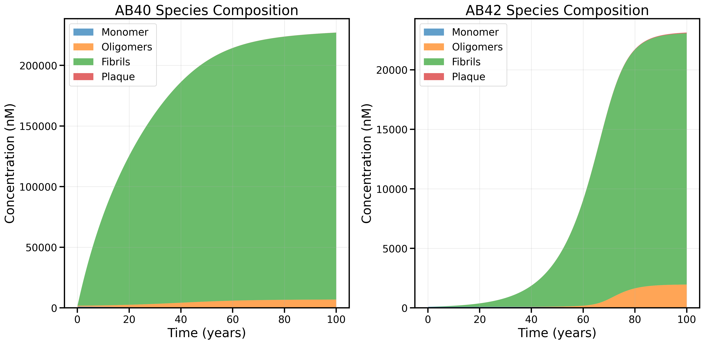
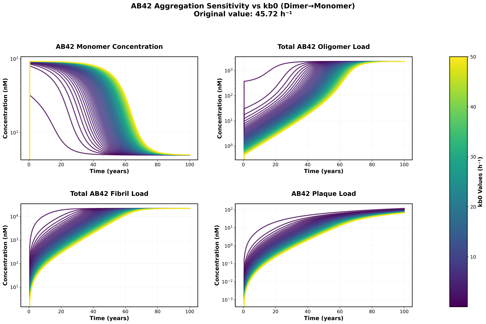

# Results

This document presents the key validation results, model comparisons, and sensitivity analyses for the Geerts model implementation.

## Table of Contents
- [Model Validation](#model-validation)
- [Implementation Comparisons](#implementation-comparisons)  
- [Sensitivity Analysis](#sensitivity-analysis)
- [Known Limitations](#known-limitations)

## Model Validation

### Single Dose Antibody Pharmacokinetics (Figure 4 Replication)

The figure below demonstrates that our model accurately reproduces the published plasma pharmacokinetics (PK) for a single 300 mg subcutaneous dose of gantenerumab. The solid black line shows the model output, while the red circles represent experimental data from the literature extracted using WebPlotDigitizer.


*Replication of Figure 4: Comparison of model-predicted and experimental plasma concentrations for gantenerumab after a single 300 mg subcutaneous dose. The model closely matches the published data, validating our implementation for this scenario.*

### Natural Life Cycle Simulation (Figure 3 Replication)

However, running our model for the natural life cycle of amyloid aggregation shows significant differences from the published material.


*NOTE This branch contains the updated formulas for Microglia dependent clearance of Oligomers and Fibrils using Vmax, EC50, and Hi_Lo_Ratio rather than the CL_High and CL_Low values. Replication of Figure 3: Simulation of the natural life cycle (from 20–100 years) of amyloid aggregation for an individual virtual Alzheimer's disease patient as in an observational study. Age-related pathology is implemented as an exponential decrease in monomer degradation. The publication used linear decline, but stated that both provide similar results and only the exponential parameters were made available. This decline resulted in an increased amount of monomers being pushed into the aggregation pathway. The 2x2 layout displays: SUVR progression (top left), brain plasma AB42/AB40 ratio (top right), ISF AB42 concentration (bottom left), and CSF AB42 concentration (bottom right).*


*Published Fig 3*

**Matches Published Curves**:

✅ Steep transition around age 60 observed in all curves

✅ **SUVR Age 60 Transition**: Similar to the publication, our model shows a distinct spike in SUVR around age 60, corresponding to the transition from monomer-dominated to oligomer/fibril/plaque-dominated amyloid burden.

**Requires Further Calibration**:

❌ Aβ42 monomer concentrations in ISF are ~10-fold higher than experimental values

❌ Aβ42 monomer concentrations in CSF are ~10-fold higher than experimental values

❌ Aβ42/40 ratio exhibits correct temporal dynamics but incorrect absolute values

❌ **SUVR Magnitude Discrepancy**: While the temporal dynamics match the published data, our SUVR spike is much lower in magnitude compared to the literature values.


**SUVR Calculation Details:**

The SUVR formula used in our model implements a Hill function to relate amyloid burden to PET imaging signal:

```
SUVR = C0 + C1*(Ab42_oligo + Ab42_proto + C3*Ab42_plaque)^Hill/((Ab42_oligo + Ab42_proto + C3*Ab42_plaque)^Hill + C2^Hill)
```

**Note**: There were misspecified parameter names in the model supplement for this calculation. A sum of oligomers/fibrils weighted by size was used to define total loads as described in the supplement.


*Published SUVR equation from the model supplement*

**SUVR Parameters:**

| Parameter | Value | Units | Source | Description |
|-----------|-------|-------|--------|-------------|
| SUVR_C0 | 1.0 | DIMENSIONLESS | Exp data | Baseline value in SUVR calculation (fixed at 1) |
| SUVR_C1 | 2.5 | DIMENSIONLESS | Fitted from interventional studies | Constant for multiplication of numerator |
| SUVR_C2 | 400,000 | nM | Fitted from interventional studies | EC50 value in SUVR calculation with concentration units |
| SUVR_C3 | 1.3 | DIMENSIONLESS | Fitted from interventional studies | Dimensionless weight factor for plaques in SUVR calculation |
| SUVR_Hill | 3.5 | DIMENSIONLESS | Fitted from interventional studies | Hill coefficient for SUVR calculation |

**SUVR Detection Threshold**: The total weighted concentration of Aβ42 (oligomers + protofibrils + plaque) must significantly exceed 400,000 nM before a detectable SUVR signal (>1.0) becomes visible. This suggests our model may be underestimating the amyloid burden or the SUVR calculation parameters need adjustment.

**Implications:**
The requirement for such high amyloid concentrations before SUVR detection suggests either:
1. Our model underestimates amyloid accumulation rates
2. The SUVR calculation parameters need recalibration
3. Additional amyloid species not captured in our model contribute significantly to PET signal

### Amyloid Species Composition: Model Evolution and Rate Law Insights

A key challenge in reproducing the published natural life cycle of amyloid aggregation was the inability to capture the characteristic "age 60 transition" in species composition, as seen in the original publication (see Figure 3 above). Below, we show the evolution of our model's predictions for AB40 and AB42 species composition as we refined our approach to the oligomer-to-plaque rate law.

#### 1. **Original Model (Old Rate Law): No Age 60 Transition, Plaque Dominates**


*AB40 and AB42 species composition using the original rate law (prior to discovering the new relationship between forward rates and oligomer-to-plaque rates explained in Model_Details). The model fails to reproduce the age 60 transition: plaque dominates the total amyloid burden for both AB40 and AB42, and there is little evidence of the expected shift in species composition with age.*

#### 2. **New Rate Law (Garai Value for Trimer-to-Dimer Backward Rate): Oligomers and Fibrils Increase, Plaque Drops**


*Species composition after implementing the new rule relating forward rates to oligomer-to-plaque rates, but with the trimer-to-dimer backward rate (kb1) set to the Garai 2013 value (1.08 h⁻¹). This change increases the abundance of oligomers and fibrils for Abeta40 and plaque levels drop dramatically for both species. However the age 60 transition is still not observed and Abeta42 is dominated by a constant population of Monomers.*

#### 3. **New Rate Law + Sensitivity Analysis (Low Trimer-to-Dimer Backward Rate): Age 60 Transition Emerges**



*Species composition using the new rate law and, based on sensitivity analysis, setting the trimer-to-dimer backward rate (kb1) to the lower cutoff (1e-5 h⁻¹). This adjustment enables the model to reproduce the steep age 60 transition in AB42 species composition, with a marked increase in oligomers and fibrils at the expense of plaque.*

#### **Discussion and Remaining Issues**

These results demonstrate that the relationship between forward rates and oligomer-to-plaque rates is critical for capturing the age-dependent transition in amyloid species composition. By lowering the trimer-to-dimer backward rate (kb1), we are able to reproduce the steep transition around age 60, a hallmark of the published data. Notably, this adjustment leads to a much higher abundance of oligomers and fibrils, and a reduction in plaque compared to both our earlier model and the published results.

**However, a key discrepancy remains:**  
While the age 60 transition is now present, the model predicts much less plaque and more monomers than reported in the literature. The reason for this imbalance is not yet fully understood and is the subject of ongoing investigation. Potential factors include the precise values and scaling of aggregation rates, the role of IDE clearance, and other parameter uncertainties highlighted in our sensitivity analysis.

## Implementation Comparisons

### SBML vs ODE Model Agreement


This analysis was performed to diagnose why we failed to reproduce the natural life cycle results. 

Cross-validation between our modular SBML implementation and the direct ODE implementation shows excellent agreement, confirming the accuracy of our SBML-to-reactions translation.

These results confirm that we have accurately translated the ODE system to a reaction network in SBML and that the issue lies in the published material itself.


*Comparison of SBML-based and direct ODE implementations for AB42/AB40 monomer ratios in brain plasma. The excellent agreement validates our translation from ODEs to reaction-based SBML format. This comparison can be made as well with the diffrax and SBML-to-ODE-jax implementation with the use of compare_no_dose_models.py*

**Validation Results:**
- ✅ Brain plasma AB42/AB40 ratios
- ✅ ISF concentrations
- ✅ CSF concentrations
- ✅ Oligomer dynamics
- ✅ Overall kinetics: Excellent agreement

### Tellurium Implementation Validation

The ability to use additional solver tools without needing to re write out model shows the benefit of SBML and being able to save models in XML format. 

We have confirmed that the Tellurium/RoadRunner simulation offers the same results for the no dose case as our JAX version. 
This is useful for debugging our natural life cycle issue as Tellurium is much faster. 

- ✅ Identical results to SBML implementation in no-dose simulations
- ✅ Faster simulation times for parameter exploration
- ✅ Robust numerical stability across parameter ranges
- ✅ Consistent with both SBML and ODE versions


However we are currently unable to get Tellurium to work for our multi dose tests. 


## Sensitivity Analysis

### Aggregation Rate Sensitivity

Analysis of sensitivity to amyloid beta aggregation rates reveals key model behaviors:




*Sensitivity analysis showing the effects of varying backward rate constants (kb0, kb1) on monomer, oligomer, fibril, and plaque concentrations over a 100-year simulation.*

**Key Findings:**

- Much lower backward rates can result in more interesting Abeta42 dynamics and Gain factors that more closely match those published in the supplement


**Parameter Ranges Tested:**
- kb0 (dimer dissociation Abeta 42): [0.1, 50.0]
- kb1 (trimer dissociation Abeta 42): [1e-05, 1.0] 
- Forward rates: Maintained at literature values

## Known Limitations

### Current Issues Under Investigation

#### Amyloid Beta Aggregation Dynamics

The model currently has unidentified issues affecting the amyloid beta aggregation pathway:

**Symptoms:**
- Monomers accumulate at higher than expected concentrations
- Oligomer and plaque concentrations are too low

**Investigation Status:**
- We feel the root cause is most likely in the way aggregation rates are extrapolated from the low order rates. 
- Backward rates are significantly higher than forward for Ab42 perhaps leading to the overabundance of monomers. 
- ✅ Recent success in finding a relationship between forward rates and higher order oligomer -> plaque rates gave us significant improvement. We are now able to capture the age 60 transition from monomers to fibrils / plaques which was a significant challenge for us in the past few months. 
- ✅ Sensitivity analysis is pointing us toward using low initial backward rates for Abeta42. The fact that these rates were not reported in TabelS2 suggests that they did not use the Garai values and these parameters were fit to data.
- Another potential issue is the IDE clearance which in addition to the rate extrapolation have the least details in the supplementary material
- 🔍 **Parameter Review**: Systematic validation of parameters. Many parameters match one-to-one between equations in TableS1 and parameters in TableS2, but a subset had ambiguous names leading to our need to guess where they fit in.  

#### Parameter Validation Gaps

Some parameters lack direct experimental validation:

| Parameter Category | Validation Status | Notes |
|-------------------|------------------|-------|
| Aggregation rates | ⚠️ Partial | Small oligomer rates validated |

### Computational Performance

**Runtime Considerations:**
- Full multi-dose simulation: TBT
- No-dose simulation (20 years): TBT
- Parameter sensitivity analysis: TBT

**Optimization Approaches:**
- Use Tellurium or ODE version for sensitivity analysis
- Scipy or JAX Optax for optimization

## Validation Roadmap

### Short-term Goals
1. **Parameter Investigation**: Systematic review of all parameters in the supplementary Tables
2. **Literature Cross-validation**: Detailed comparison with additional published datasets
3. **Parameter Sensitivity Completion**: Full sensitivity analysis across all uncertain parameters


### Long-term Goals
1. **Open Sourced Alzheimer's Disease Models**: Make this model along with others available on the BioModels Repository

2. **Modular Design**: Using the modular design we have developed we aim to have a mix and match set of modules that can be recombined to gain additional insight. 
