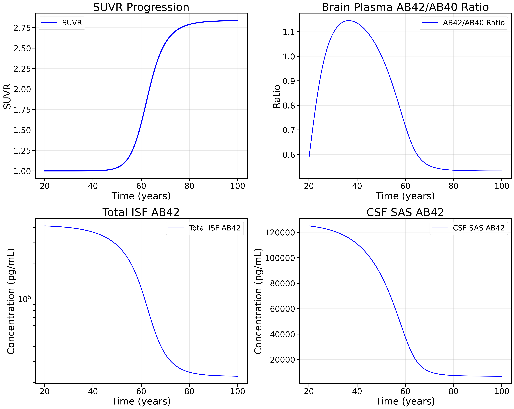
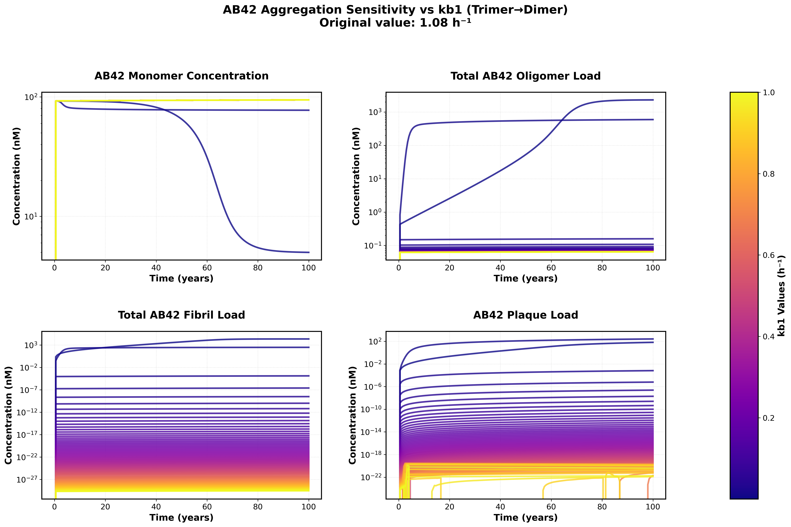

# Results

This document presents the key validation results, model comparisons, and sensitivity analyses for the Geerts model implementation.

## Table of Contents
- [Model Validation](#model-validation)
- [Implementation Comparisons](#implementation-comparisons)  
- [Sensitivity Analysis](#sensitivity-analysis)
- [Known Limitations](#known-limitations)

## Model Validation

### Single Dose Antibody Pharmacokinetics (Figure 4 Replication)

The figure below demonstrates that our model accurately reproduces the published plasma pharmacokinetics (PK) for a single 300 mg subcutaneous dose of gantenerumab. The solid black line shows the model output, while the red circles represent experimental data from the literature extracted using WebPlotDigitizer.

*Replication of Figure 4: Comparison of model-predicted and experimental plasma concentrations for gantenerumab after a single 300 mg subcutaneous dose. The model closely matches the published data, validating our implementation for this scenario.*

### Natural Life Cycle Simulation (Figure 3 Replication)

However, running our model for the natural life cycle of amyloid aggregation shows significant differences from the published material.

*Replication of Figure 3: Simulation of the natural life cycle (from 20–100 years) of amyloid aggregation for an individual virtual Alzheimer's disease patient as in an observational study. Age-related pathology is implemented as an exponential decrease in monomer degradation. The publication used linear decline, but stated that both provide similar results and only the exponential parameters were made available. This decline resulted in an increased amount of monomers being pushed into the aggregation pathway. We are able to reproduce the steep transition around the age of 60 years followed by a slow saturation at higher ages for the ABeta42/40 ratio, ISF or CSF ABeta 42 concentration. However futher improvement is required to fully match published results*

*Published Fig 3*

**Matches Published Curves**:

✅ Steep transition around age 60 observed in all curves

**Requires Further Calibration**:

❌ Aβ42 monomer concentrations in ISF are ~10-fold higher than experimental values
❌ Aβ42 monomer concentrations in CSF are ~10-fold higher than experimental values
❌ Aβ42/40 ratio exhibits correct temporal dynamics but incorrect absolut

## Implementation Comparisons

### SBML vs ODE Model Agreement

This analysis was performed to diagnose why we failed to reproduce the natural life cycle results. 

Cross-validation between our modular SBML implementation and the direct ODE implementation shows excellent agreement, confirming the accuracy of our SBML-to-reactions translation.

These results confirm that we have accurately translated the ODE system to a reaction network in SBML and that the issue lies in the published material itself.

*Comparison of SBML-based and direct ODE implementations for AB42/AB40 monomer ratios in brain plasma. The excellent agreement validates our translation from ODEs to reaction-based SBML format. This comparison can be made as well with the diffrax and SBML-to-ODE-jax implementation with the use of compare_no_dose_models.py*

**Validation Results:**
- ✅ Brain plasma AB42/AB40 ratios
- ✅ ISF concentrations
- ✅ CSF concentrations
- ✅ Oligomer dynamics
- ✅ Overall kinetics: Excellent agreement

### Tellurium Implementation Validation

The ability to use additional solver tools without needing to re write out model shows the benefit of SBML and being able to save models in XML format. 

We have confirmed that the Tellurium/RoadRunner simulation offers the same results for the no dose case as our JAX version. 
This is useful for debugging our natural life cycle issue as Tellurium is much faster. 

- ✅ Identical results to SBML implementation in no-dose simulations
- ✅ Faster simulation times for parameter exploration
- ✅ Robust numerical stability across parameter ranges
- ✅ Consistent with both SBML and ODE versions

However we are currently unable to get Tellurium to work for our multi dose tests. 

## Sensitivity Analysis

### Aggregation Rate Sensitivity

Analysis of sensitivity to amyloid beta aggregation rates reveals key model behaviors:

*Sensitivity analysis showing the effects of varying backward rate constants (kb0, kb1) on monomer, oligomer, fibril, and plaque concentrations over a 100-year simulation.*

**Key Findings:**

- Much lower backward rates can result in more interesting Abeta42 dynamics and Gain factors that more closely match those published in the supplement

**Parameter Ranges Tested:**
- kb0 (dimer dissociation Abeta 42): [0.1, 50.0]
- kb1 (trimer dissociation Abeta 42): [1e-05, 1.0] 
- Forward rates: Maintained at literature values

## Known Limitations

### Current Issues Under Investigation

#### Amyloid Beta Aggregation Dynamics

The model currently has unidentified issues affecting the amyloid beta aggregation pathway:

**Symptoms:**
- Monomers accumulate at higher than expected concentrations
- Oligomer and plaque concentrations are too low

**Investigation Status:**
- We feel the root cause is most likely in the way aggregation rates are extrapolated from the low order rates. 
- Backward rates are significantly higher than forward for Ab42 perhaps leading to the overabundance of monomers. 
- ✅ Recent success in finding a relationship between forward rates and higher order oligomer -> plaque rates gave us significant improvement. We are now able to capture the age 60 transition from monomers to fibrils / plaques which was a significant challenge for us in the past few months. 
- ✅ Sensitivity analysis is pointing us toward using low initial backward rates for Abeta42. The fact that these rates were not reported in TabelS2 suggests that they did not use the Garai values and these parameters were fit to data.
- Another potential issue is the IDE clearance which in addition to the rate extrapolation have the least details in the supplementary material
- 🔍 **Parameter Review**: Systematic validation of parameters. Many parameters match one-to-one between equations in TableS1 and parameters in TableS2, but a subset had ambiguous names leading to our need to guess where they fit in.  

#### Parameter Validation Gaps

Some parameters lack direct experimental validation:

| Parameter Category | Validation Status | Notes |
|-------------------|------------------|-------|
| Aggregation rates | ⚠️ Partial | Small oligomer rates validated |

### Computational Performance

**Runtime Considerations:**
- Full multi-dose simulation: TBT
- No-dose simulation (20 years): TBT
- Parameter sensitivity analysis: TBT

**Optimization Approaches:**
- Use Tellurium or ODE version for sensitivity analysis
- Scipy or JAX Optax for optimization

## Validation Roadmap

### Short-term Goals
1. **Parameter Investigation**: Systematic review of all parameters in the supplementary Tables
2. **Literature Cross-validation**: Detailed comparison with additional published datasets
3. **Parameter Sensitivity Completion**: Full sensitivity analysis across all uncertain parameters

### Long-term Goals
1. **Open Sourced Alzheimer's Disease Models**: Make this model along with others available on the BioModels Repository

2. **Modular Design**: Using the modular design we have developed we aim to have a mix and match set of modules that can be recombined to gain additional insight. 
